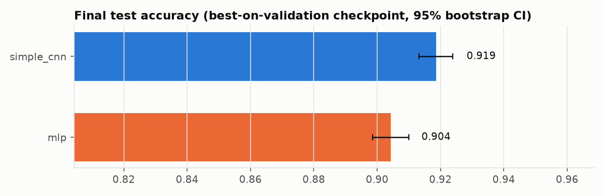
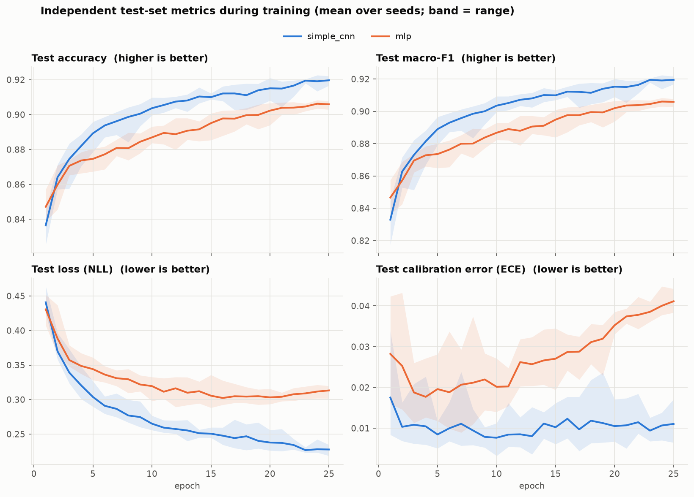

# nn-arch-benchmark

Compares how well different neural-network architectures learn from real image
data, using TensorFlow/Keras inside Docker (or Podman). Each architecture is
trained on the same splits with the same optimiser and budget, over several
random seeds, and evaluated on an independent held-out test set.

## Results: simple_cnn vs mlp on Fashion-MNIST

Full Fashion-MNIST (54k train / 6k validation / 10k independent test), 10
seeds per architecture, up to 25 epochs, GTX 1650. Config:
[`configs/fashion_mnist_top2.yaml`](configs/fashion_mnist_top2.yaml).

| | **simple_cnn** | **mlp** |
|---|---|---|
| Test accuracy (mean ± std, 10 seeds) | **0.9186 ± 0.0036** | 0.9043 ± 0.0040 |
| Macro-F1 | **0.9185** | 0.9042 |
| Top-3 accuracy | **0.9947** | 0.9919 |
| Test loss (NLL) | **0.231** | 0.309 |
| Calibration error (ECE) | **0.012** | 0.037 |
| Parameters | **422k** | 1.47M |
| Train time per run | 82 s | **44 s** |
| Single-image latency | **5.1 ms** | 7.4 ms |



- **The CNN wins with ¼ of the parameters.** Every CNN seed beat every MLP seed.
  An exact McNemar test (seed 42) gives p = 4.8e-05, meaning the two models'
  test errors differ by more than chance.
  Convolutions give the model a built-in bias toward local image structure,
  which matters more than raw parameter count.
- **The MLP becomes overconfident.** From about epoch 15 its test loss and
  calibration error rise while its accuracy barely improves, as the curves below
  show. The CNN's calibration stays flat at about 0.01.
- **The hardest class for both is "shirt"** (F1 0.76 CNN / 0.74 MLP). About 10%
  of shirts are predicted as t-shirts, and most other errors are coat or
  pullover.
- **Both models were probably still improving.** Most seeds reached their best
  validation score at epoch 23–25 of 25, so a longer budget would likely raise
  both scores a little.



Reproduce with `make run CONFIG=configs/fashion_mnist_top2.yaml` (about 22 min
on a GTX 1650).

## What's in here

```
nnbench/
  data.py      dataset loading + stratified train/val split, normalisation, augmentation
  models.py    architectures under comparison
  train.py     training loop, per-epoch test tracking, final evaluation, speed timing
  metrics.py   accuracy, macro-F1, top-3, NLL, ECE, bootstrap CI, McNemar test
  report.py    plots + Markdown report from a finished run
  run.py       entry point: config -> train all (arch, seed) pairs -> report
configs/
  smoke.yaml          minutes-long pipeline check (Fashion-MNIST subset, 3 epochs)
  fashion_mnist.yaml  full Fashion-MNIST benchmark
  cifar10.yaml        main benchmark (CIFAR-10)
tests/                unit tests for models and metrics
Dockerfile, compose.yaml, Makefile
```

## Data and evaluation protocol

Datasets are real, public image collections downloaded by Keras and cached in
`./data`:

| Dataset | Images | Classes |
|---|---|---|
| `cifar10` | 60k 32×32 colour photos | 10 (airplane, cat, truck, …) |
| `fashion_mnist` | 70k 28×28 grayscale product photos | 10 (shirt, sneaker, bag, …) |
| `mnist` | 70k 28×28 handwritten digits | 10 |

- **Test set** = the dataset's official test split. It is never used for
  fitting, normalisation statistics, early stopping, LR scheduling or checkpoint
  selection. It is evaluated every epoch *for reporting only*, so you can see how
  generalisation evolves.
- **Validation set** = a stratified 10% slice of the official training split
  (`val_fraction`). All training-time decisions use it.
- Normalisation mean/std are computed from the training portion only.
- Augmentation (horizontal flip + 10% translation) applies to architectures
  listed in `augment_architectures`.

## Architectures

| Name | Idea |
|---|---|
| `mlp` | Fully connected baseline, no spatial inductive bias |
| `simple_cnn` | LeNet-style: two conv/pool stages + dense head |
| `vgg_small` | Three VGG blocks of stacked 3×3 convs, BatchNorm, dropout |
| `resnet_small` | ResNet-14-ish: three stages of two residual blocks |
| `mobilenet_small` | MobileNetV2-style inverted residuals with depthwise convs |

All are sized to train on a 4 GB GPU. Pick any subset with `--archs`. Add a new
one by decorating a builder with `@register("name")` in `nnbench/models.py`.

Training setup (shared): AdamW, sparse categorical cross-entropy, the best
checkpoint on `val_accuracy`, early stopping, and ReduceLROnPlateau on `val_loss`.

## Running

Needs Docker or Podman (the Makefile auto-detects which). CPU runs need nothing
else. For GPU runs, see [GPU setup](#gpu-setup) first.

```bash
make build-cpu            # CPU image  (nn-arch-benchmark:cpu)
make build                # GPU image  (nn-arch-benchmark:gpu)

make test                 # unit tests in the CPU image
make smoke                # few-minute end-to-end check on CPU

make run                                       # CIFAR-10, all archs, GPU
make run CONFIG=configs/fashion_mnist.yaml     # faster benchmark
make run ARGS="--archs simple_cnn,resnet_small --epochs 20 --seeds 42,43"
make run-cpu CONFIG=...                        # same on CPU (slow for CIFAR-10)

make report RUN=results/<run_dir>              # rebuild report from saved results
make shell                                     # bash inside the CPU image
```

Or with Compose:

```bash
docker compose run --rm bench                              # GPU, CIFAR-10
docker compose run --rm bench-cpu --config configs/smoke.yaml
```

CLI flags (`python -m nnbench.run`): `--config`, `--out`, `--epochs`,
`--archs a,b`, `--seeds 1,2`. They override the config file. Defaults for
every config key are in `nnbench/run.py`.

## GPU setup

The host needs a working NVIDIA driver (`nvidia-smi` works) plus the NVIDIA
Container Toolkit, so containers can see the GPU. On Fedora/RHEL:

```bash
sudo curl -sL https://nvidia.github.io/libnvidia-container/stable/rpm/nvidia-container-toolkit.repo \
  -o /etc/yum.repos.d/nvidia-container-toolkit.repo
sudo dnf install -y nvidia-container-toolkit
sudo nvidia-ctk cdi generate --output=/etc/cdi/nvidia.yaml   # Podman (CDI)
```

On Debian/Ubuntu, add the apt repo instead (see NVIDIA's
[install guide](https://docs.nvidia.com/datacenter/cloud-native/container-toolkit/latest/install-guide.html)).
For Docker, run `sudo nvidia-ctk runtime configure --runtime=docker && sudo systemctl restart docker`
instead of the CDI step.

**Re-run `nvidia-ctk cdi generate` after every NVIDIA driver update.** Otherwise
Podman fails with `unresolvable CDI devices nvidia.com/gpu=all`.

Check that TensorFlow sees the GPU inside the image:

```bash
podman run --rm --device nvidia.com/gpu=all --security-opt=label=disable \
  --entrypoint python nn-arch-benchmark:gpu \
  -c "import tensorflow as tf; print(tf.config.list_physical_devices('GPU'))"
```

It should print one `PhysicalDevice(... device_type='GPU')`. Training logs also
start with `TensorFlow 2.21.0 · GPUs: [...]`. If that says `none (CPU)`, the run
is silently on CPU.

**Why the Dockerfile installs `tensorflow[and-cuda]`:** the official
`tensorflow/tensorflow:2.21.0-gpu` image ships CUDA 12.3 and no cuDNN, but TF
2.21 needs CUDA ≥ 12.5 and cuDNN 9. As shipped, TF either skips the GPU
(`Cannot dlopen some GPU libraries`) or crashes on the first convolution
(`Autotuner could not find any supported configs`). The GPU build therefore
installs TF's own matched NVIDIA wheels (CUDA 12.9, cuDNN 9.x), and the CPU
build skips this step.

Tested on a GTX 1650 (4 GB, driver 610.57) under rootless Podman on Fedora.

## Output

Each run writes `results/<experiment>_<timestamp>/`:

| Path | Contents |
|---|---|
| `report.md` | ranked results table, McNemar significance table, plots |
| `summary.csv` | per-architecture mean/std over seeds |
| `results_per_run.csv` | one row per (architecture, seed) |
| `history/*.csv` | per-epoch train/val/test metrics, LR, timing |
| `final/*.json` | final test metrics, per-class F1, confusion matrix |
| `predictions/*.npy` | test-set probabilities (plus `y_test.npy`) |
| `models/*.keras` | best-on-validation checkpoints |
| `config.json` | full resolved config + environment (TF version, GPUs) |
| `plots/` | test curves, generalisation gap, accuracy, efficiency, per-class F1, confusion |

Reported metrics: test accuracy with a 95% bootstrap CI, macro-F1, top-3
accuracy, NLL, expected calibration error, best epoch, training time,
throughput, and single-image latency. The pairwise exact McNemar test shows
whether two models' test errors differ by more than chance.

## Rough cost

The full `cifar10.yaml` is 5 architectures × 3 seeds × up to 40 epochs, so 15
training runs. On a GTX 1650-class GPU, expect several hours. Use
`fashion_mnist.yaml`, fewer seeds, or `--archs` to cut it down.
